# Crafting recipes graph

Emoji icons match [`web/src/game/content/items.ts`](web/src/game/content/items.ts). Drag source **A** onto target **B** (see [`web/src/game/content/recipes.ts`](web/src/game/content/recipes.ts)). Each link is labeled with **B**.

Regenerate after editing recipes or item icons:

```bash
node web/scripts/genCraftingRecipesGraph.mjs
```

```mermaid
flowchart LR
  subgraph sec_base_recipes["Base recipes"]
    Stick["🪵"] -->|"+ 🪨"| Spear["🗡️"]
    Ash["⚫️"] -->|"+ 🟡"| Firebolt["🔥"]
    Sulfur["🟡"] -->|"+ ⚫️"| Fireshield["🛡️"]
  end
  subgraph sec_weapon_tool_assembly["Weapon / tool assembly"]
    Stone["🪨"] -->|"+ 🪓"| StoneShard["🪨"]
    Stick["🪵"] -->|"+ 🪨"| Spear["🗡️"]
    Stick["🪵"] -->|"+ 🪢"| Bow["🏹"]
    Twine["🪢"] -->|"+ 🪵"| Sling["🪃"]
    Stone["🪨"] -->|"+ 🪢"| Bolas["🪢"]
  end
  subgraph sec_remedies_cooking["Remedies & cooking"]
    Stick["🪵"] -->|"+ 🧵"| WaterbagEmpty["🫙"]
    Twine["🪢"] -->|"+ 🌿"| WaterskinEmpty["🧴"]
    GlassVial["🧴"] -->|"+ 🪢"| TravelFlaskEmpty["⚗️"]
    ClothScrap["🧵"] -->|"+ 🧵"| BandageStrip["🩹"]
    HerbLeaf["🍃"] -->|"+ 🧵"| HerbPoultice["🌿"]
    BitterHerb["🌱"] -->|"+ 🧴"| AntitoxinVial["🧪"]
    Foodroot["🥕"] -->|"+ 🪨"| MortarMeal["🥣"]
    MortarMeal["🥣"] -->|"+ 💧"| Flourball["🍞"]
    HerbLeaf["🍃"] -->|"+ 💧"| HerbTea["🫖"]
  end
  subgraph sec_headwear["Headwear"]
    ClothScrap["🧵"] -->|"+ 🪢"| WoolCap["🧢"]
    HerbLeaf["🍃"] -->|"+ 🪢"| HerbCirclet["🌼"]
    Mushrooms["🍄"] -->|"+ 🧵"| SporeCap["🍄"]
  end
  subgraph sec_breadth_combos["Breadth combos"]
    Mushrooms["🍄"] -->|"+ ⚫️"| BitterHerb["🌱"]
    Ash["⚫️"] -->|"+ 🍄"| HerbLeaf["🍃"]
    StoneShard["🪨"] -->|"+ 🪢"| Chisel["🪓"]
    Twine["🪢"] -->|"+ 🪨"| GlassVial["🧴"]
  end
  subgraph sec_light_bio_food_tools["Light, bio, food, tools"]
    Stick["🪵"] -->|"+ 🌿"| Torch["🔥"]
    Glowbug["✨"] -->|"+ 🪢"| Headlamp["🔦"]
    Torch["🔥"] -->|"+ 🧃"| Lantern["🏮"]
    Sweetroot["🍠"] -->|"+ 🪨"| MushedRoot["🥣"]
    MushedRoot["🥣"] -->|"+ 🍄"| Shroomcake["🎂"]
    Shroomcake["🎂"] -->|"+ 🍠"| Shroompie["🥧"]
    MushedRoot["🥣"] -->|"+ 💧"| Rootsoup["🍲"]
    Rootsoup["🍲"] -->|"+ 🧂"| RootsoupSalted["🍲"]
    Grubling["🐛"] -->|"+ 🧂"| PreservedGrub["🥫"]
    Slime["🫧"] -->|"+ 🌿"| Fungus["🍄"]
    Mucus["💧"] -->|"+ 🍄"| Mold["🦠"]
    Fungus["🍄"] -->|"+ 💧"| Slime["🫧"]
    Mold["🦠"] -->|"+ 🍃"| SporePaste["🫗"]
    Mushrooms["🍄"] -->|"+ 🦠"| SporePaste["🫗"]
    Mold["🦠"] -->|"+ 🍄"| BitterHerb["🌱"]
    SporePaste["🫗"] -->|"+ 💧"| SporeStew["🍜"]
    Gem["💎"] -->|"+ 🪢"| GemCharm["📿"]
    ClothScrap["🧵"] -->|"+ 🌿"| MossWrap["🧣"]
    Moss["🌿"] -->|"+ 🪢"| MossSandals["🩴"]
    SporePaste["🫗"] -->|"+ 🧂"| BrinedSpore["🥫"]
    Salt["🧂"] -->|"+ 🫗"| Mold["🦠"]
    Ash["⚫️"] -->|"+ 🪢"| SmolderBundle["🔥"]
    BobrJuice["🧃"] -->|"+ 🌱"| RiverTonic["🍶"]
    HerbLeaf["🍃"] -->|"+ 🌿"| CoolingPoultice["🧊"]
    Salt["🧂"] -->|"+ 🧵"| DryWrap["🧻"]
    Bone["🦴"] -->|"+ 🪨"| BoneSpike["🦴"]
    Stick["🪵"] -->|"+ 💎"| Staff["🪄"]
    Staff["🪄"] -->|"+ 🗿"| AttunedStaff["✴️"]
  end
  subgraph sec_alternates["Alternates"]
    Stone["🪨"] -->|"+ 🏏"| StoneShard["🪨"]
    Stick["🪵"] -->|"+ 🦞"| Spear["🗡️"]
    Twine["🪢"] -->|"+ 🦴"| Bolas["🪢"]
    Twine["🪢"] -->|"+ 🦞"| Sling["🪃"]
  end
  subgraph sec_claw_twine_bolas_twine_claw_is_sling_mirror_twin["Claw + Twine → Bolas (Twine+Claw is Sling; mirror Twine+Bone tuning)"]
    Claw["🦞"] -->|"+ 🪢"| Bolas["🪢"]
    Tooth["🦷"] -->|"+ 🪨"| BoneSpike["🦴"]
    Twine["🪢"] -->|"+ 🦷"| Bolas["🪢"]
    Bone["🦴"] -->|"+ 🧵"| BandageStrip["🩹"]
    Claw["🦞"] -->|"+ 🧵"| BandageStrip["🩹"]
    Tooth["🦷"] -->|"+ 🧵"| BandageStrip["🩹"]
    BandageStrip["🩹"] -->|"+ 🍃"| HerbPoultice["🌿"]
    BandageStrip["🩹"] -->|"+ 🌱"| AntitoxinVial["🧪"]
    Ash["⚫️"] -->|"+ 🪵"| Torch["🔥"]
    Foodroot["🥕"] -->|"+ 🌿"| MortarMeal["🥣"]
    MortarMeal["🥣"] -->|"+ 🍄"| Shroomcake["🎂"]
    Flourball["🍞"] -->|"+ 🍄"| Shroomcake["🎂"]
    Grubling["🐛"] -->|"+ 🌿"| PreservedGrub["🥫"]
    StoneShard["🪨"] -->|"+ 🦴"| Chisel["🪓"]
    StoneShard["🪨"] -->|"+ 🦞"| Chisel["🪓"]
    StoneShard["🪨"] -->|"+ 🦷"| Chisel["🪓"]
    Claw["🦞"] -->|"+ 🪨"| BoneSpike["🦴"]
    Bone["🦴"] -->|"+ 💎"| Staff["🪄"]
    Claw["🦞"] -->|"+ 💎"| Staff["🪄"]
    Tooth["🦷"] -->|"+ 💎"| Staff["🪄"]
  end
  subgraph sec_order_sensitive_pairs["Order-sensitive pairs"]
    Bone["🦴"] -->|"+ 🪵"| Club["🏏"]
    Stick["🪵"] -->|"+ 🦴"| Spear["🗡️"]
    Foodroot["🥕"] -->|"+ 💧"| Flourball["🍞"]
    WaterbagFull["💧"] -->|"+ 🥕"| MortarMeal["🥣"]
    Salt["🧂"] -->|"+ 🍲"| Mold["🦠"]
    ClothScrap["🧵"] -->|"+ 🍄"| HerbLeaf["🍃"]
    Slime["🫧"] -->|"+ 🍄"| Mold["🦠"]
    Fungus["🍄"] -->|"+ 🫧"| Mucus["💧"]
    WaterbagFull["💧"] -->|"+ 🫗"| SporeStew["🍜"]
    ClothScrap["🧵"] -->|"+ 🧂"| DryWrap["🧻"]
  end
  subgraph sec_campfire_kit_flint_is_slot_b_preserved_station_t["Campfire kit (Flint is slot B: preserved) + station tools"]
    Stick["🪵"] -->|"+ ✳️"| CampfireKit["🪵"]
    StoneShard["🪨"] -->|"+ 🪨"| Flint["✳️"]
    Twine["🪢"] -->|"+ 🪨"| IronPot["🍳"]
    IronPot["🍳"] -->|"+ 🪢"| Kettle["🫖"]
  end
  subgraph sec_swarm_tools["Swarm tools"]
    Twine["🪢"] -->|"+ 🪺"| SwarmBasket["🧺"]
    Hive["🪺"] -->|"+ 🐛"| CapturedSwarm["🫧"]
    Hive["🪺"] -->|"+ 🍄"| CapturedSwarm["🫧"]
  end
  subgraph sec_slime_phial_inventory_craft_world_capture_onto_w["Slime phial (inventory craft; world capture onto Wurglepup remains separate)"]
    GlassVial["🧴"] -->|"+ 🫧"| SlimePhial["🧪"]
    GlassVial["🧴"] -->|"+ 💧"| SlimePhial["🧪"]
  end
  subgraph sec_glowbug_jar_dim_hand_light_shrine_offering_vial_["Glowbug jar (dim hand light + Shrine offering; vial-first only, parallel to Slime phial)"]
    GlassVial["🧴"] -->|"+ ✨"| GlowbugJar["🫙"]
  end
  subgraph sec_add_glowbugs_to_an_existing_jar_order_sensitive_["Add glowbugs to an existing jar (order-sensitive both ways; cap 12 on the jar row)"]
    Glowbug["✨"] -->|"+ 🫙"| GlowbugJar["🫙"]
    GlowbugJar["🫙"] -->|"+ ✨"| GlowbugJar["🫙"]
  end
  subgraph sec_snailord_linked_juvenile_snail_shell_bases_npclo["Snailord-linked juvenile snail + shell (bases: `npcLoot` Snailord; procgen allowlist)"]
    Snailing["🐌"] -->|"+ 🪓"| SnailingShell["🐚"]
    Snailing["🐌"] -->|"+ 🧂"| PickledSnailing["🥫"]
    Snailing["🐌"] -->|"+ 🌿"| PickledSnailing["🥫"]
    SnailingShell["🐚"] -->|"+ 🪨"| ShellSpike["🐚"]
    SnailingShell["🐚"] -->|"+ 🪢"| ShellCharm["📿"]
    Snailing["🐌"] -->|"+ 🫧"| SnailSlimePaste["🫗"]
  end
  subgraph sec_kuratko_nest_eggs_findrecipe_maps_any_full_water["Kuratko nest eggs (`findRecipe` maps any full water vessel to `WaterbagFull` for matching)"]
    KuratkoEgg["🥚"] -->|"+ 💧"| BoiledKuratkoEgg["🥚"]
    KuratkoEgg["🥚"] -->|"+ 🍃"| HerbKuratkoOmelette["🍳"]
  end
```


